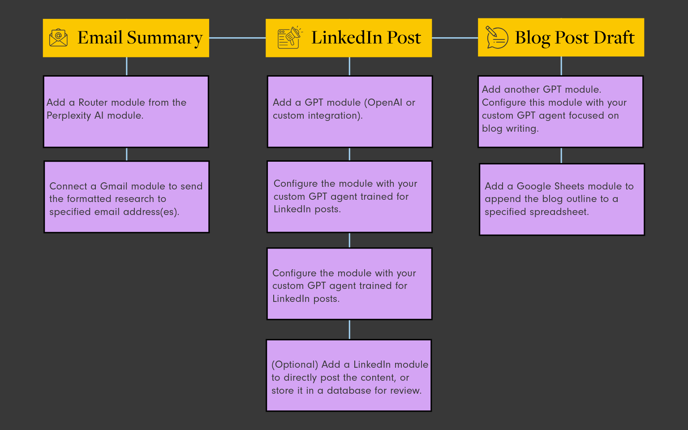

# Research Assistant Automation

## Introduction
This automation leverages the Perplexity AI API and GPT agents to streamline your content creation process. By inputting a research topic, you'll generate comprehensive research, email summaries, LinkedIn posts, and blog outlines - all tailored to your brand voice and style, with a focus on FP&A professionals.

## Step-by-step automation workflow in Make.com:

1. 🚀 **Set up a trigger:**
   * Choose an appropriate trigger (e.g., manual, scheduled, or webhook) to initiate the automation.

2. 🔍 **Perplexity AI API call:**
   * Set up an API call with Perplexity. 
   * Add the Perplexity AI module. 
   * Configure the module by adding your API credentials and research prompt.
   * Set up the request to retrieve the scraped web information.

3. 🔀 **Router module:**
   * Add a Router module to split the workflow into three paths.

4. **Path Summary**

| Path | Description | Steps |
|------|-------------|-------|
| 📧 Path 1 | Email summary | 1. Add a Router module from the Perplexity AI module.<br>2. Connect a Gmail module to send the formatted research to specified email address(es). |
| 🔗 Path 2 | LinkedIn post | 1. Add a GPT module (OpenAI or custom integration).<br>2. Configure the module with your custom GPT agent trained for LinkedIn posts.<br>3. Use a prompt like: "Turn this research into a short, engaging, and easy to read LinkedIn post that encourages professional development, education, and learning new things within the world of FP&A. It should encourage the audience to interact and engage with the post. Include relevant hashtags. Ensure that the message is less than 1500 characters. {{1.choices[].message.content}}"<br>4. **(Optional)** Add a LinkedIn module to directly post the content, or store it in a database for review. |
| 📝 Path 3 | Blog outline | 1. Add another GPT module.<br>2. Configure this module with your custom GPT agent focused on blog writing.<br>3. Use the following prompt (note that this includes functions and connections within the Make scenario): "Turn this research into a short, engaging, and SEO-based blog that is targeted at FP&A professionals including professional development, education, and learning new things within the world of FP&A. {{1.choices[].message.content}}"<br>4. Add a Google Sheets module to append the blog outline to a specified spreadsheet. |



5. 🧪 **Testing and optimization:**
   * Run test scenarios to ensure all paths are working correctly.
   * Adjust module configurations and GPT prompts as needed to refine the output.

## Additional Resources
To enhance your automation setup, the following templates are available via Google Drive links below:

1. 📄 JSON template
2. 🔗 LinkedIn post agent knowledge base template (https://drive.google.com/file/d/1j3vUNn_ksL9o-Dmacd-YXXJw-Fz5EIg6/view?usp=sharing)
3. 📝 Blog Writer knowledge base template (https://drive.google.com/file/d/1YrWUqCPf2Q0dRbgrTR4M2InFwPQJwHHo/view?usp=drive_link)

These templates can be used to customize and fine-tune your GPT agents for optimal performance in generating LinkedIn posts and blog content tailored to FP&A professionals. These versions shared will help get you started.
```
